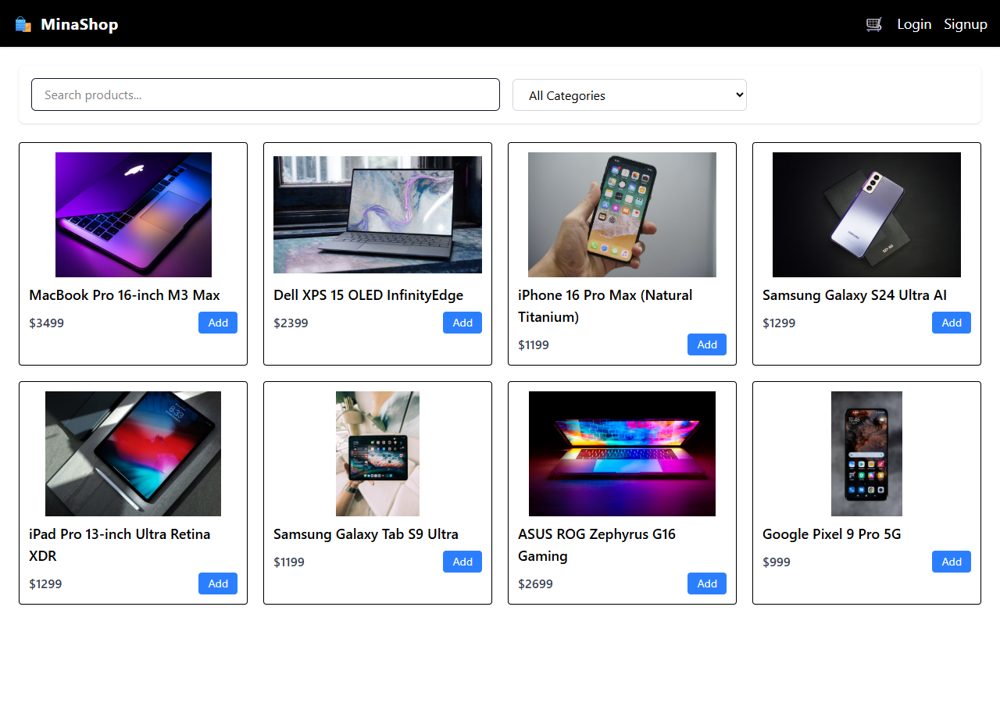
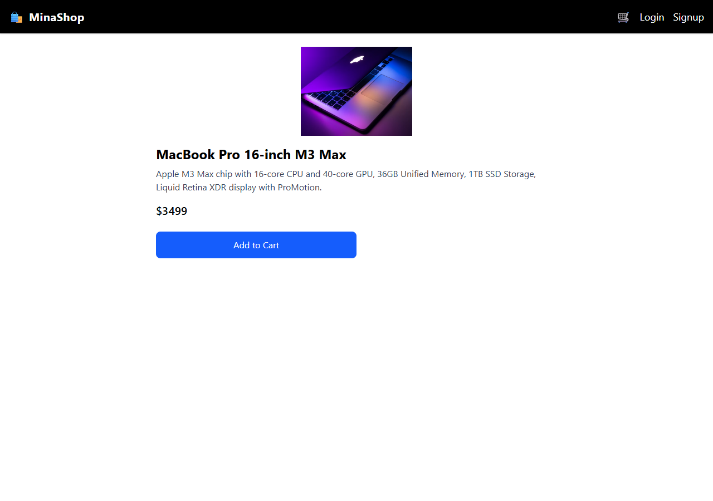
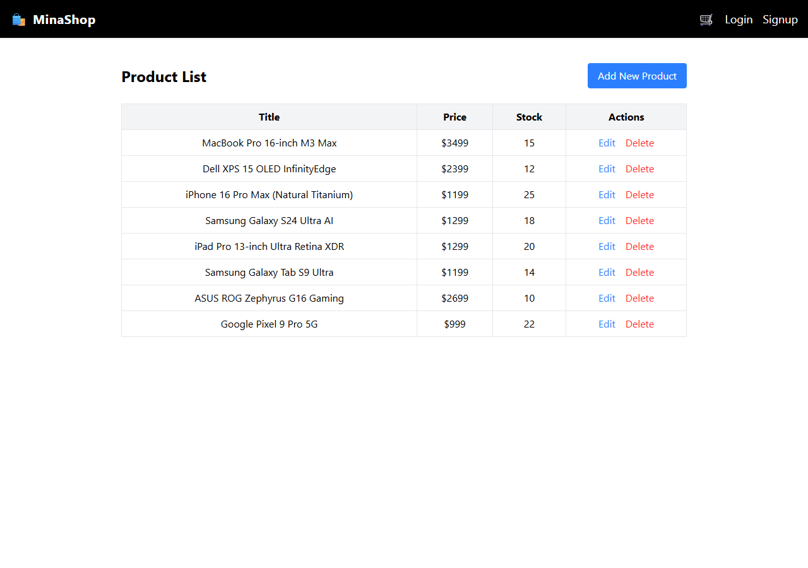
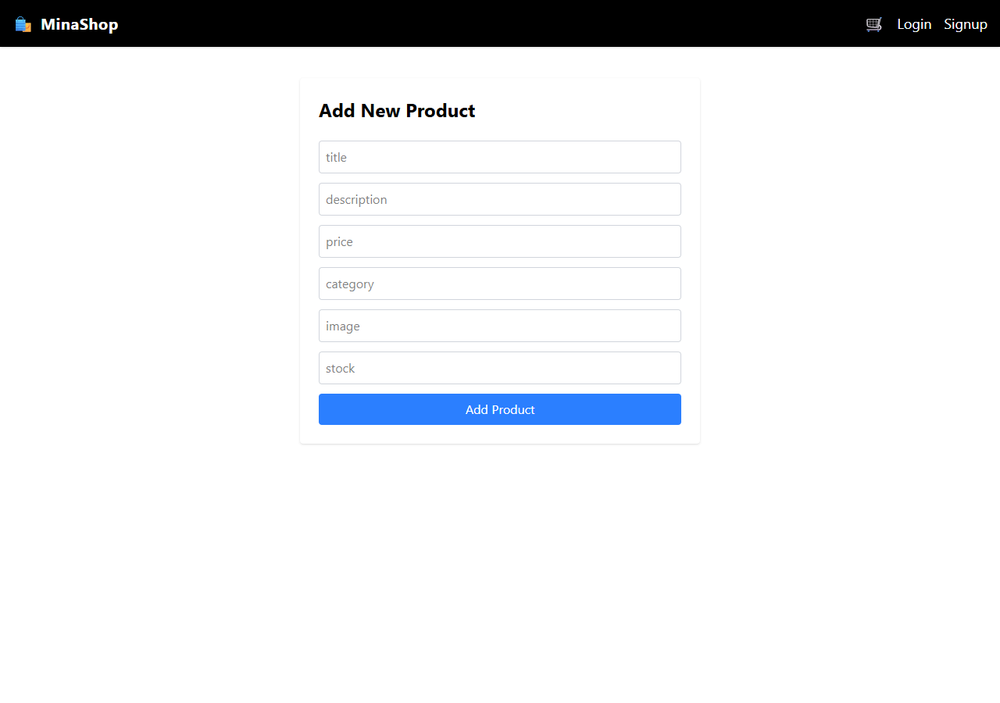
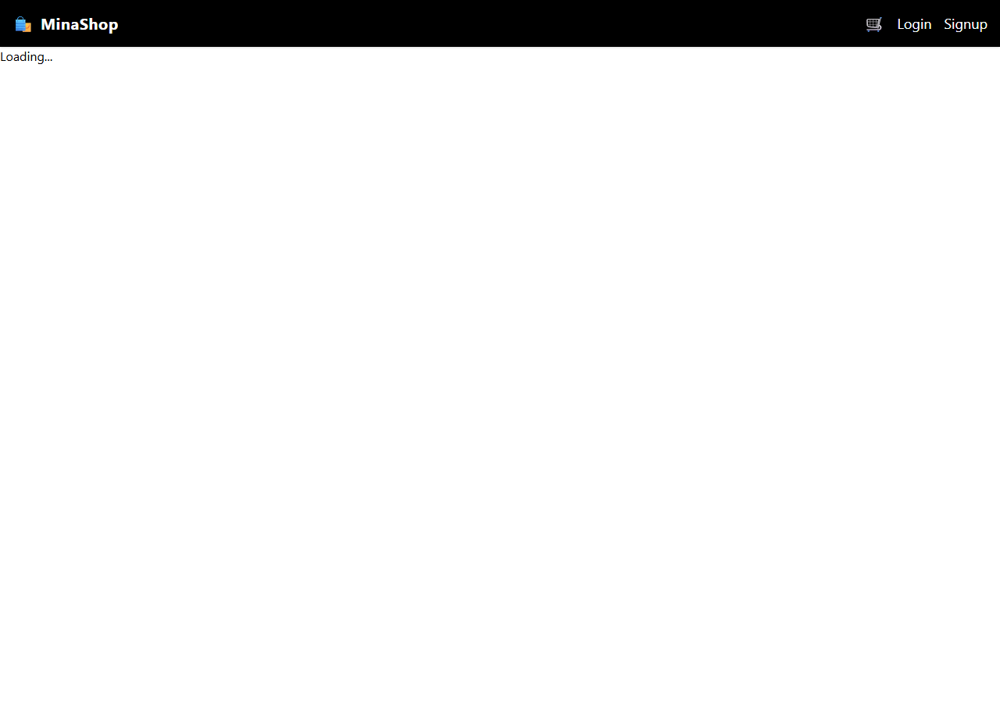
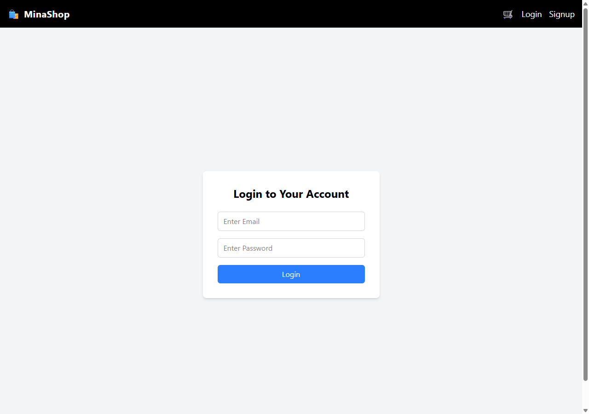

# 🛍️ MinaShop — Full-Stack MERN E-Commerce Platform

[](https://react.dev/)
[](https://nodejs.org/)
[](https://expressjs.com/)
[](https://www.mongodb.com/)
[](https://tailwindcss.com/)
[](https://vite.dev/)
[](LICENSE)

A high-performance, modern, full-stack E-Commerce web application built with the **MERN** stack (MongoDB, Express.js, React, Node.js) and styled using **Tailwind CSS**.

---

## 🌐 Live Demo & Deployment

- 🚀 **Live Demo**: [https://minakshijha16.github.io/mern-ecommerce-store/](https://minakshijha16.github.io/mern-ecommerce-store/)
- 💻 **GitHub Repository**: [https://github.com/Minakshijha16/mern-ecommerce-store](https://github.com/Minakshijha16/mern-ecommerce-store)

[](https://render.com/deploy)
[](https://vercel.com/new/clone?repository-url=https%3A%2F%2Fgithub.com%2FMinakshijha16%2Fmern-ecommerce-store&project-name=minashop&root-directory=frontend)

---

## 📸 User Interface & Screenshots

### 1. Storefront & Catalog
> Real-time product search, dynamic category filtering (Laptops, Mobiles, Tablets), and instant add-to-cart actions.



---

### 2. Product Details
> In-depth product specifications, pricing, high-resolution imagery, and cart management.



---

### 3. Admin Product Management Dashboard
> Full CRUD capabilities: view current inventory, edit prices, update stock levels, or remove listings.



---

### 4. Add New Product Interface
> Intuitive form to register new products with title, category, price, stock, and media URL.



---

### 5. Shopping Cart & Authentication
> Real-time cart calculation, quantity increments/decrements, and secure user onboarding.

| Shopping Cart | User Authentication |
|:---:|:---:|
|  |  |

---

## ✨ Features

- 🔍 **Interactive Product Discovery**: Instant client-side & server-side search coupled with category filters.
- 🛒 **Persistent Shopping Cart**: Real-time cart counter badge, quantity adjustment, and item removal.
- 🔐 **Secure Authentication**: JWT-based user login and signup with password encryption via `bcryptjs`.
- 📊 **Admin Dashboard**: Comprehensive product catalog administration with Add, Edit, and Delete workflows.
- 📬 **Checkout & Order Pipeline**: Shipping address collection, checkout verification, and order confirmation.
- ⚡ **Resilient Fallback Mode**: Graceful fallback mode ensures the catalog is immediately browsable even prior to database connection.
- 📱 **Fully Responsive**: Optimized for desktop, tablet, and mobile displays with Tailwind CSS.

---

## 🛠️ Tech Stack

| Layer | Technologies Used |
|---|---|
| **Frontend** | React 19, Vite 7, Tailwind CSS v4, React Router 7, Axios |
| **Backend** | Node.js 24, Express 5.x REST API, JSON Web Tokens (JWT), Bcrypt.js |
| **Database** | MongoDB, Mongoose 9 ODM |
| **DevOps & CI/CD** | GitHub Actions, GitHub Pages, Render, Vercel SPA rewrites |

---

## 🚀 Quick Start / Local Setup

### 1. Clone the Repository
```bash
git clone https://github.com/Minakshijha16/mern-ecommerce-store.git
cd mern-ecommerce-store
```

### 2. Configure Environment Variables
Create a `.env` file in the `backend/` directory:
```env
PORT=5001
MONGO_URI=mongodb://localhost:27017/mern-ecommerce
JWT_SECRET=your_secret_key_here
```

*(Optional)* Create a `.env` file in the `frontend/` directory:
```env
VITE_API_URL=http://localhost:5001/api
```

### 3. Install Dependencies
```bash
# Install root, backend, and frontend dependencies
npm run install:all
```

### 4. (Optional) Seed Sample Products
Populate your database with sample laptops, smartphones, and tablets:
```bash
npm run seed --prefix backend
```

### 5. Run the Application
Start the backend and frontend concurrently:
```bash
npm run dev
```

- **Frontend**: `http://localhost:5173`
- **Backend API**: `http://localhost:5001`

---

## 📡 API Reference

### Authentication
- `POST /api/auth/signup` — Register a new customer
- `POST /api/auth/login` — Authenticate and receive JWT token

### Products
- `GET /api/products` — Retrieve products (supports `?search=` and `?category=`)
- `POST /api/products/add` — Create product (Admin)
- `PUT /api/products/update/:id` — Update existing product
- `DELETE /api/products/delete/:id` — Remove product

### Cart
- `GET /api/cart/:userId` — Fetch active cart for user
- `POST /api/cart/add` — Add item to cart
- `POST /api/cart/remove` — Remove item from cart
- `POST /api/cart/update-quantity` — Update item quantity

### Orders & Address
- `POST /api/address/add` — Save shipping address
- `GET /api/address/:userId` — Fetch saved shipping addresses
- `POST /api/order/place` — Place an order

---

## 👩‍💻 Author

**Minakshi Jha**
- GitHub: [@Minakshijha16](https://github.com/Minakshijha16)
- Email: [minakshijha016@gmail.com](mailto:minakshijha016@gmail.com)

---

## 📄 License

This project is open source and available under the [MIT License](LICENSE).
